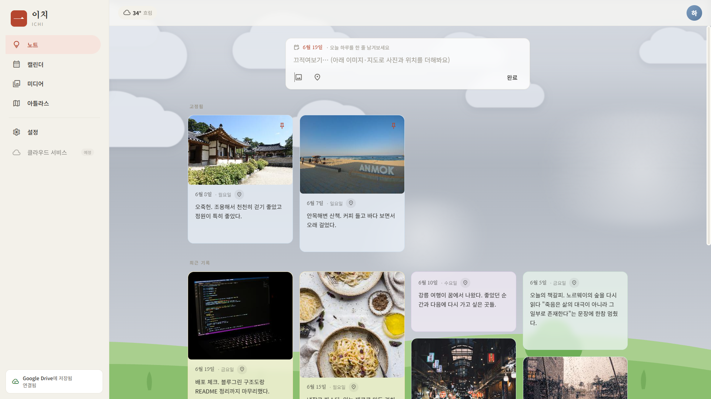
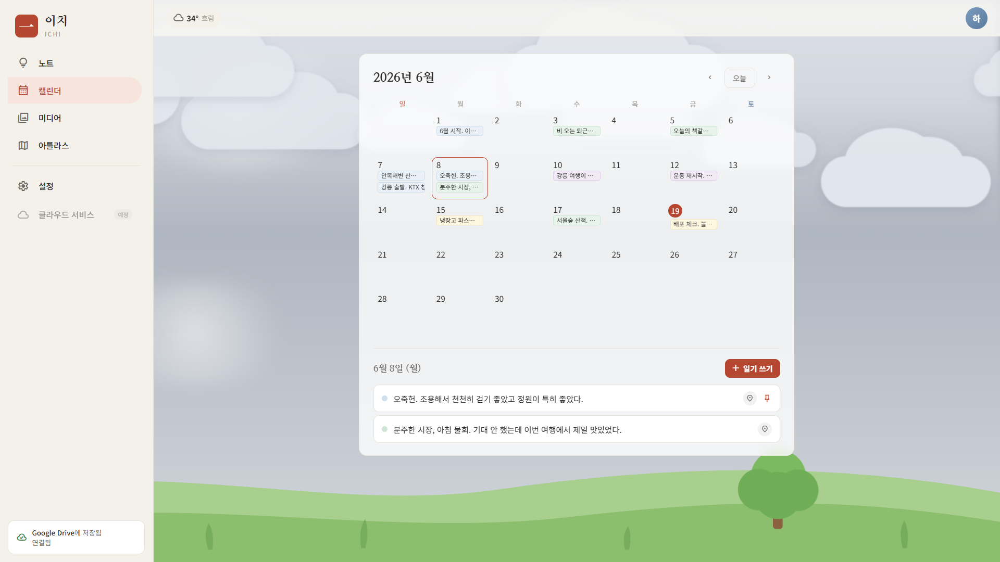
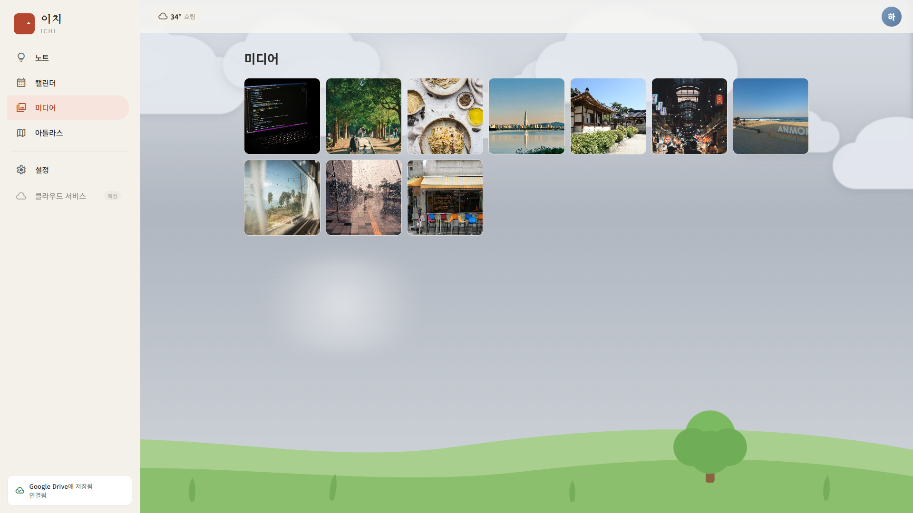
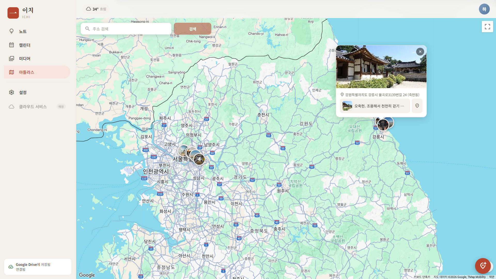
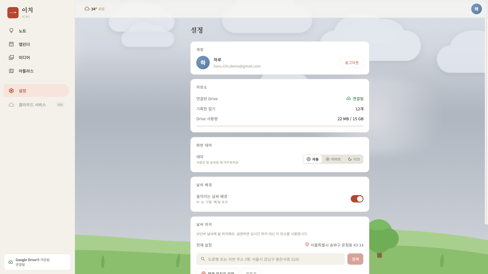
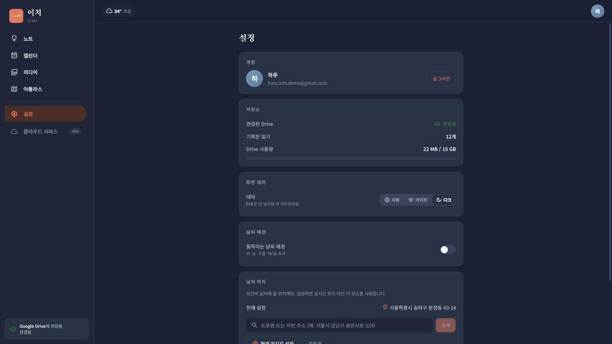
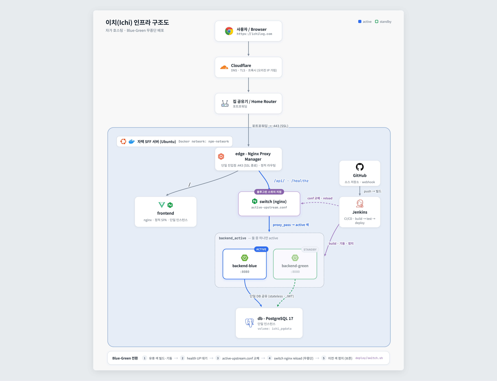

<div align="center">

# 이치 (一 · Ichi)

**하루를 가볍게 끄적이는 일기장.**

[**🌐 ichilog.com**](https://ichilog.com)

내 기록은 내 Google Drive에. 우리 서버엔 본문이 남지 않습니다.

</div>

---

## 이치는 어떤 서비스인가요?

이치는 Google Keep처럼 **부담 없이 짧게 쓰는 일기장**입니다.
오늘 있었던 일을 한 줄이든 사진 한 장이든 가볍게 남기고, 캘린더·지도·갤러리로 다시 들여다볼 수 있어요.

가장 큰 특징은 **내 일기가 내 Google Drive에 저장된다**는 점입니다.
글과 사진·영상은 본인 Drive의 앱 전용 폴더에 들어가고, 이치 서버에는 정렬·검색에 필요한 가벼운 정보만 남습니다.
서비스를 떠나도 기록은 **내 Drive에 그대로** 남습니다.

> 📓 일기 본문 · 사진 · 영상 → **내 Google Drive**
> 🗂️ 날짜 · 위치 · 미리보기 같은 메타데이터만 → 이치 서버

---

## 주요 기능

### 📝 노트 — 가볍게 쓰는 하루
- Google Keep 같은 **카드형** 일기. 핀 고정, 색상 지정.
- 글 **중간 아무 위치에 사진 넣기** — 클립보드 **붙여넣기**와 **드래그 앤 드롭** 둘 다 지원(한 장당 25MB). 글과 사진이 섞인 진짜 일기.
- 자주 쓰는 동작에 로딩/저장 표시, 삭제 확인 등 자잘한 UX를 다듬었습니다.



### 📅 캘린더 — 한 달을 한눈에
- 월간 그리드에서 **일기 쓴 날**을 점으로 표시.
- 날짜를 고르면 그날의 일기 목록이 뜨고, **위치를 붙인 일기엔 장소 아이콘**이 함께 보입니다.
- **지난 날짜로도** 새 일기를 쓸 수 있습니다.



### 🖼️ 미디어 — 사진·영상 갤러리
- 일기에 넣은 사진/영상을 **갤러리**로 모아 보기(서버 썸네일 생성).
- 사진을 누르면 그 사진이 담긴 일기로 이동.



### 🗺️ 아틀라스 — 기억을 지도 위에
- 위치를 붙인 일기를 **지도 위 핀**으로. 핀은 그 일기의 **첫 사진 썸네일**로 보입니다.
- 지도를 움직여 위치를 맞추고 **그 자리에서 바로 새 일기**를 쓸 수 있어요.



### 🌤️ 날씨 분위기
- 상단바에 **현재 위치 날씨**(기온 + 한국어 설명).
- (선택) **움직이는 날씨 배경** — 실제 날씨에 맞춰 비/눈/구름/해·달·별이 은은하게 흐릅니다. `prefers-reduced-motion` 존중.



### ⚙️ 설정 & 그 외
- **다크/라이트/자동** 테마, 날씨 배경 토글, 계정/로그아웃.
- **모바일 앱**(iOS·Android) *(예정)* — 같은 화면을 네이티브 앱으로 감싸는 작업을 준비 중입니다(Capacitor).



---

## 시작하기

1. [**ichilog.com**](https://ichilog.com) 접속
2. **Google 계정으로 로그인** — 일기를 저장할 본인 Drive 접근을 허용합니다.
3. 오늘 하루를 한 줄, 끄적이기 ✍️

> 이치는 일기를 저장하기 위해 **본인 Google Drive의 앱 전용 폴더**에만 접근합니다.
> 다른 Drive 파일은 보지 않으며, 본문은 이치 서버에 저장되지 않습니다.

---

## 개인정보 & 데이터

- **일기 본문·사진·영상**은 사용자 본인의 Google Drive(앱 전용 폴더)에 저장됩니다.
- 이치 서버에는 **날짜·위치·미리보기 텍스트** 등 목록/검색용 메타데이터만 보관합니다.
- Google 로그인 토큰은 서버에서 암호화해 보관합니다.
- **종단간 암호화(E2E)** *(예정)* — 본문을 내 기기에서 암호화해 Drive에 올려, 누구도(이치 서버 포함) 열어볼 수 없게 하는 방식을 설계해 두었습니다. 저장 경로가 한 곳(`StorageService`)으로 모여 있어 나중에 끼워 넣을 수 있습니다.

### 내 Drive에 이렇게 저장됩니다

일기를 쓰면 본인 Drive의 `ichi` 폴더 아래에 **날짜 → 일기별 폴더**로 차곡차곡 정리됩니다.

```
ichi/
└── 2026-06-17/                         # 날짜별 폴더
    └── 오늘은 비가 _a1b2c3d4-…/         # 일기 폴더 (미리보기 10글자 + 고유 ID)
        ├── 2026-06-17_일기장.txt        # 사람이 바로 읽는 사본 (글자만, Drive에서 열어보기용)
        ├── json/
        │   └── body.json               # 앱이 읽고 쓰는 원본 (글 + 사진 참조)
        └── media/
            ├── IMG_0420.jpg            # 일기에 넣은 사진
            └── clip.mp4                #          영상
```

- **`<날짜>_일기장.txt`** — 태그를 걷어낸 순수 텍스트라, 이치 없이 Drive에서 열어도 그날 일기가 그대로 읽힙니다.
- **`json/body.json`** — 글 중간에 넣은 사진까지 보존하는 원본. 이치 앱이 읽고 쓰는 파일입니다.
- **`media/`** — 일기에 붙인 사진·영상 원본.

> 즉, 서비스를 떠나도 일기는 **내 Drive에 사람이 읽을 수 있는 형태**로 남습니다.

자세한 저장 정책은 [개발 문서](docs/DEVELOPMENT.md#보안--저장-정책-메모)를 참고하세요.

---

## 기술 스택

| 영역 | 스택 |
| --- | --- |
| 프론트엔드 | Vue 3.5 · Vite · TypeScript · Pinia |
| 백엔드 | Spring Boot 4.1 · Java 25 · PostgreSQL 17 |
| 모바일 *(예정)* | Capacitor 8 (iOS / Android) |
| 저장소 | Google Drive API (appDataFolder) |
| 지도 · 날씨 | Google Maps · Open-Meteo |

---

## 인프라 구조 (자가 호스팅 · 블루그린 무중단 배포)

이치는 **클라우드 없이 자택 서버에 직접 구축·배포**했습니다.
사용자 요청은 **Cloudflare** 를 거쳐 **집 공유기**로 들어오고, 포트포워딩을 통해
거실의 **SFF(소형 폼팩터) 컴퓨터 — Ubuntu 서버**로 연결됩니다. 그 위에서 모든 컨테이너가 돕니다.

서버 안에서는 **Nginx Proxy Manager(NPM)** 가 진입점이 되어 도메인·TLS 를 처리하고,
**프론트와 백엔드를 각각 다른 nginx 로 분리**해 프록시합니다.

- 도메인 `/` → **frontend nginx**(빌드된 정적 SPA, 단일)
- 도메인 `/api/` → **API 엣지 nginx**(`api-edge`) → **Spring Boot blue/green** 중 active 색

배포는 **Jenkins** 로 CI/CD 합니다. 코드를 푸시하면 Jenkins 가 빌드·테스트 후
유휴 색(blue/green)에 새 버전을 올리고, `api-edge` 의 upstream conf 를 바꿔 health 통과 후
트래픽을 넘기는 **블루그린 무중단 배포**를 수행합니다. 프론트는 단일이라 전환 대상이 아닙니다.
백엔드는 stateless(JWT)라 두 색이 **같은 DB 를 공유**하고, DB·프론트는 단일입니다.



- **Cloudflare** — DNS·TLS 종료·프록시로 오리진(자택) IP 를 가리고 외부에서 `ichilog.com` 으로 접속.
- **집 공유기** — 포트포워딩으로 외부 트래픽을 내부 SFF 서버로 전달.
- **SFF 서버 (Ubuntu)** — Docker 로 NPM·frontend·api-edge·backend(blue/green)·db 를 모두 호스팅하는 자가 구축 서버.
- **NPM (Nginx Proxy Manager)** — 진입점. 도메인·TLS 처리, `/` → frontend / `/api/` → api-edge 로 프록시.
- **api-edge nginx** — 백엔드 전용 엣지. `api-edge.conf` 가 active 색 백엔드로 라우팅(블루그린 스위치).
- **Jenkins (CI/CD)** — 푸시 → 빌드/테스트 → blue/green 무중단 배포 자동화. `deploy/switch.sh` 로 트래픽 전환.

> frontend·api-edge 는 NPM 의 외부 네트워크(`npm-network`)에, 백엔드·DB 는 내부 네트워크(`ichi-net`)에
> 묶입니다. 내부 컨테이너는 포트를 외부로 노출하지 않고, 시크릿은 `deploy/.env` 로만 주입합니다.
> blue/green 이 같은 DB 를 보므로 파괴적 스키마 변경은 **expand → contract** 로 나눠 적용합니다.
> (Jenkins CI compose 는 운영 compose 와 절대 한 파일/네트워크에 섞지 않습니다.)

자세한 구성·명령은 [배포 가이드](deploy/README.md)를 참고하세요.

---

## 개발자용 문서

- 🛠️ **[개발 가이드](docs/DEVELOPMENT.md)** — 로컬 실행, 아키텍처, 인증 흐름, 마일스톤, 배포
- ☁️ **[Google Cloud 설정](docs/google-setup.md)** — OAuth · Drive · Maps 키 발급
- 🚀 **[배포(블루그린)](deploy/README.md)** — 무중단 배포 구성

---

<div align="center">
<sub>一 · 하루 한 줄.</sub>
</div>
